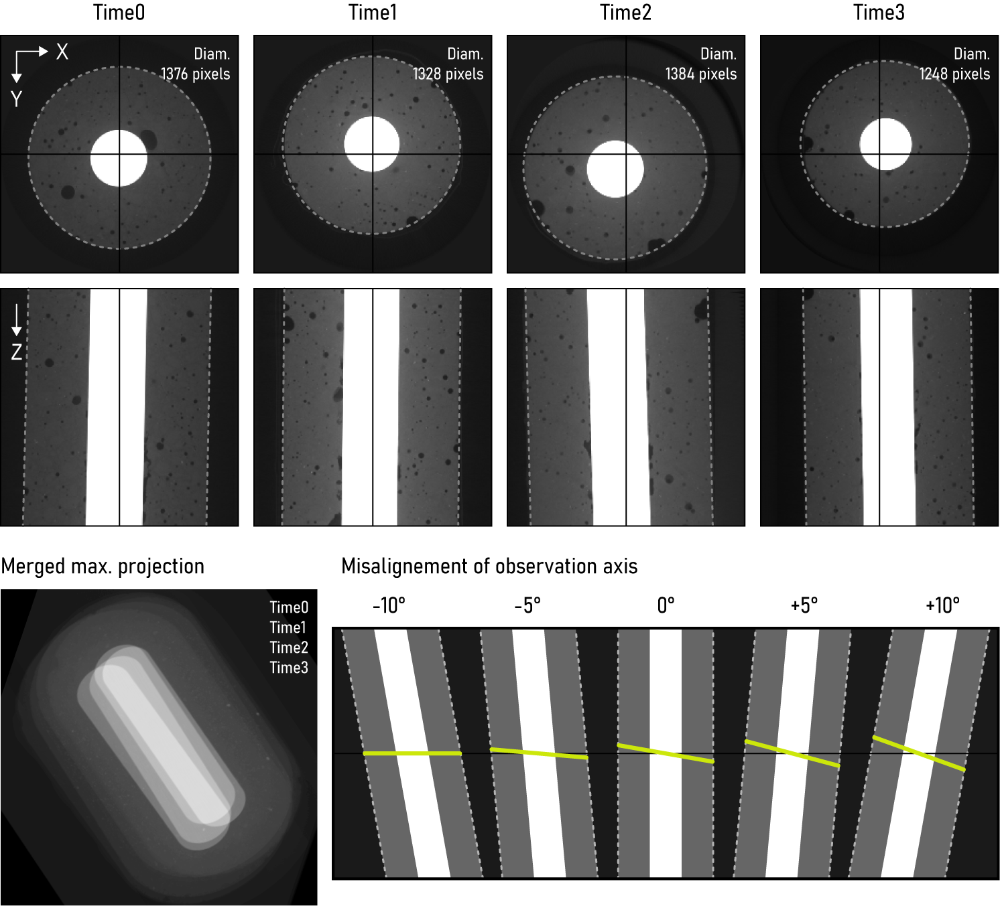

?logo=python&logoColor=rgb(149%2C157%2C165)&labelColor=rgb(50%2C60%2C65))
?logo=TensorFlow&logoColor=rgb(149%2C157%2C165)&labelColor=rgb(50%2C60%2C65))
?logo=NVIDIA&logoColor=rgb(149%2C157%2C165)&labelColor=rgb(50%2C60%2C65))
?logo=NVIDIA&logoColor=rgb(149%2C157%2C165)&labelColor=rgb(50%2C60%2C65))    
&color=rgb(149%2C157%2C165))
&color=rgb(149%2C157%2C165))
&color=rgb(149%2C157%2C165))    

# ETH-ScopeM_Concrete  
Concrete rebar CT scan analysis tool

## Index
- [Installation](#installation)
- [Main procedure](#main-procedure)
- [Registration](#registration)
- [Display](#display)
- [Outputs](#outputs)
- [Comments](#comments)

## Installation

Pease select your operating system

<details> <summary>Windows</summary>  

### Step 1: Download this GitHub Repository 
- Click on the green `<> Code` button and download `ZIP` 
- Unzip the downloaded file to a desired location

### Step 2: Install Miniforge (Minimal Conda installer)
- Download and install [Miniforge](https://github.com/conda-forge/miniforge) for your operating system   
- Run the downloaded `.exe` file  
    - Select "Add Miniforge3 to PATH environment variable"  

### Step 3: Setup Conda 
- Open the newly installed Miniforge Prompt  
- Move to the downloaded GitHub repository
- Run one of the following command:  
```bash
# TensorFlow with GPU support
mamba env create -f environment_tf_gpu.yml
# TensorFlow with no GPU support 
mamba env create -f environment_tf_nogpu.yml
```  
- Activate Conda environment:
```bash
conda activate concrete
```
Your prompt should now start with `(concrete)` instead of `(base)`

</details> 

<details> <summary>MacOS</summary>  

### Step 1: Download this GitHub Repository 
- Click on the green `<> Code` button and download `ZIP` 
- Unzip the downloaded file to a desired location

### Step 2: Install Miniforge (Minimal Conda installer)
- Download and install [Miniforge](https://github.com/conda-forge/miniforge) for your operating system   
- Open your terminal
- Move to the directory containing the Miniforge installer
- Run one of the following command:  
```bash
# Intel-Series
bash Miniforge3-MacOSX-x86_64.sh
# M-Series
bash Miniforge3-MacOSX-arm64.sh
```   

### Step 3: Setup Conda 
- Re-open your terminal 
- Move to the downloaded GitHub repository
- Run one of the following command: 
```bash
# TensorFlow with GPU support
mamba env create -f environment_tf_gpu.yml
# TensorFlow with no GPU support 
mamba env create -f environment_tf_nogpu.yml
```  
- Activate Conda environment:  
```bash
conda activate concrete
```
Your prompt should now start with `(concrete)` instead of `(base)`

</details>  


## Main procedure
### `process_main.py`
Main processing tasks executed on original image stacks

1) **Downscale** (reduce processing time)  
```bash
# For downscale factor (df) = 4  
original stack (z, y, x)  = 1948 x 1788 x 1788 = 13 Gb  
downscaled stack (z, y, x)  = 487 x 447 x 447 = 186 Mb
```

#

2) **Preprocess**
    - center images over Z axis
    - compute median projection (`med_proj`)
    - normalize images (divide by `med_proj` to get `norm`)
    - determine matrix and rod masks (`mtx_mask`, `rod_mask`)
    - compute distance maps  
        `mtx_EDM` - distance from outer surface  
        `rod_EDM` - distance from inner rod


#

3) **Predict** (U-Net - resnet34)
    - manually annotate data (Napari)
    - train semantic segmentation model (~ 25 image pairs)
    - save weights (`model-weights_void.hdf5`)
    - predict un-seen images (`obj_probs`)


#

4) **Segment**
    - segment voids from `obj_probs`
    - normalize void brightness (custom fitting procedure)
    - determine air and liquid masks (`air_mask`, `liquid_mask`)


#

5) **Objects**
    - extract `obj_data` (see [outputs folder](#outputs-folder))

## Registration
### `register_main.py`

Between different timepoints, the image stacks exhibit inconsistencies in terms \
of translation, rotation, and scaling within the 3D space.



#

1) **Match object pairs**
    - compare segmented objects for:
        - distance to outer surface
        - distance to neighbors
        - shape descriptors (area, solidity)
    - identify valid pairs (min. difference between comparison criteria)

#

2) **Register 3D stacks**
    - compute affine transformation matrix (based on valid pair centroids)
    - apply transformation and save registered data (see [registered folder](#registered-folder))

## Display
### `display_probs.py`
### `display_mask.py`

Display prediction (`display_probs.py`) and segmentation (`display_mask.py`) \
results in a customized Napari viewer.


## Outputs

### data folder

```bash
- Time0_crop_df4.tif # crop + downscale raw images  
- Time0_crop_df4_norm.tif # crop + downscale + norm. images  
- Time0_crop_df4_probs.tif # obj. predictions (model)  
- Time0_crop_df4_air_mask.tif # labelled mask of obj.  
- Time0_crop_df4_liquid_mask.tif # mask of air-filled regions  
- Time0_crop_df4_labels.tif # mask of liquid-filled regions  
- Time0_crop_df4_metadata.pkl # processing metadata  
```

### registered folder

```bash
- crop_df4_reg.tif # registered crop + downscale raw images
- crop_df4_reg_norm.tif # registered crop + downscale + norm. images
- crop_df4_reg_probs.tif # registered obj. predictions
- crop_df4_reg_air_mask.tif # registered air masks
- crop_df4_reg_liquid_mask.tif # registered liquid masks
- crop_df4_transform_matrix.pkl # registration transformation matrices
```

### outputs folder

1) **`obj_data.csv`**  
```bash
- label # obj. identification label (see `labels.tif`)
- ctrd_z # obj. z position 
- ctrd_y # obj. y position
- ctrd_x # obj. x position
- area # obj. number of voxel (3D volume)
- air_area # air number of voxel (3D volume)
- liquid_area # liquid number of voxel (3D volume)
- ratio # liquid / obj. volume
- solidity # obj. volume / obj. convex hull volume
- obj_dist # distance from neighbouring obj.
- mtx_dist # distance from external matrix surface
- category # 0 = inner obj., 1 = surface obj., 2 = rod obj
```
2) **`plot.jpg`**

## Comments
- **To fix**
    - expl `D1_ICONX_DOS_reg_norm.tif` z=70 t=3
    - expl `D12_ICONX_Corrosion_reg_norm.tif` z=70 t=3